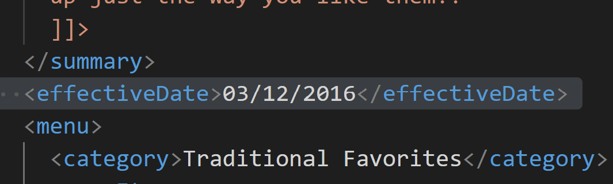
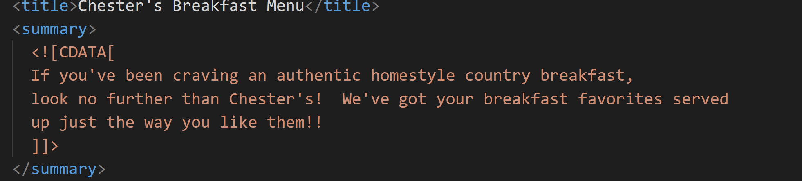
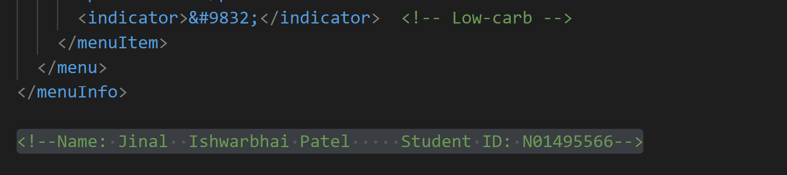
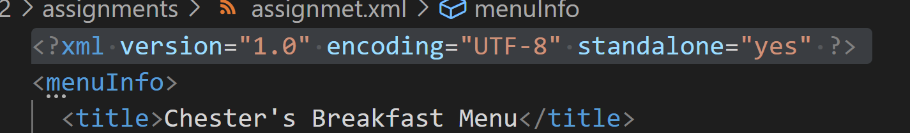
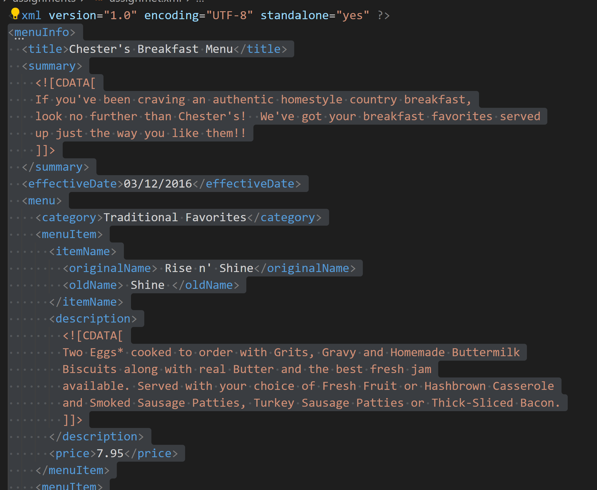
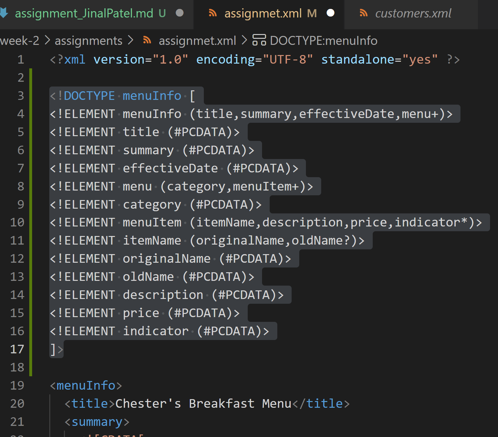
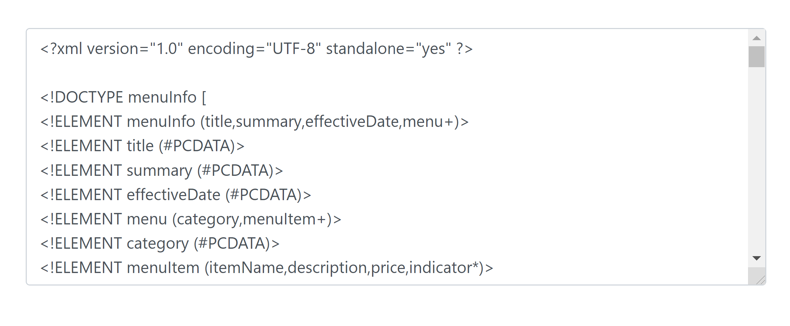
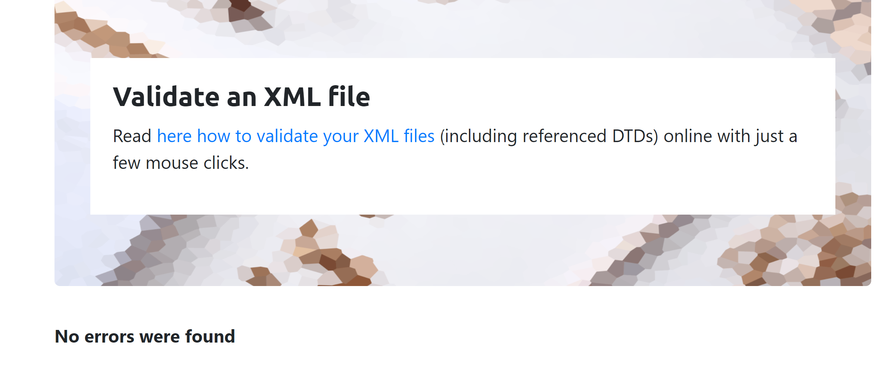
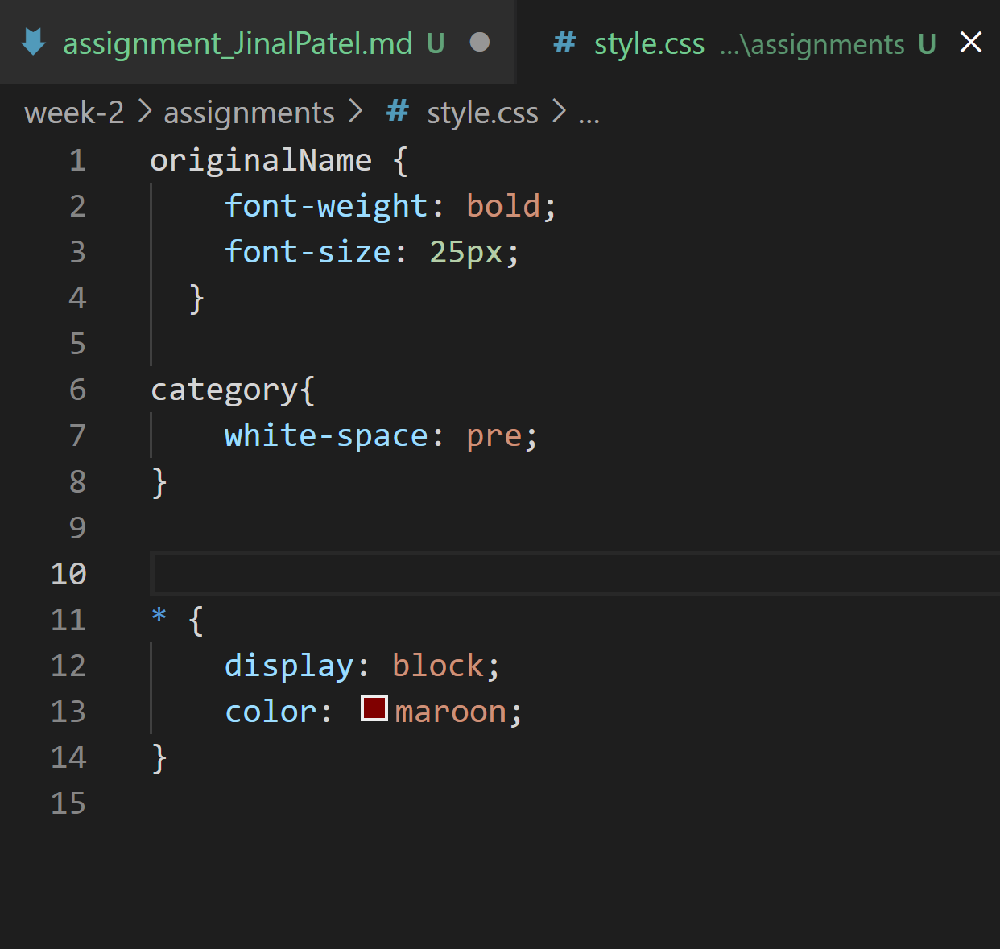

# Assignment 1

# 1. Open week-2/assignments/assignment.xml in your browser. Are there any errors? Explain the error and fix it.
Answer: The error I found out was, 
         " <effective Date>03/12/2016</effective Date> "
         Here, data is a data type in XML and hence, here it is being read as a data type and not a whole attribute. So, Attribute name "Date" associated with an element type "effective" can be reframed as following to make the document error free:
         " <effectiveDate>03/12/2016</effectiveDate> "

# 2. What is the use of CDATA block in this document?
Answer: CDATA refers to character data. CDATA contains block of text which is ignorned by the parser. Basically, they are not parsed by the parser, but are generally recognized as markup. 

In the above images, the content specified between CDATA is treated as character data and not as markup.

# 3. Add comment line to the end of file which contains you name and student id.
Answer: 

# 4. Identify prolog, document body, and epilog in the document. Are there any processing instructions?

Answer: Prolog contains XML declaration, optional processing instructions and comment lines, also the document type declaration. 

The prolog in this document is: 

Document body consists of the main body in the xml document, after the declaration and before epilog. 

The document body in this document is: 

Epilog consists of the processing instructions and comment lines, however epilog is optional in the xml document. 
There's no epilog in the document.

# 5. Add inline DTD for this document.
Answer: Added the DTD as following: 

<!DOCTYPE menuInfo [
<!ELEMENT menuInfo (title,summary,effectiveDate,menu+)>
<!ELEMENT title (#PCDATA)>
<!ELEMENT summary (#PCDATA)>
<!ELEMENT effectiveDate (#PCDATA)>
<!ELEMENT menu (category,menuItem+)>
<!ELEMENT category (#PCDATA)>
<!ELEMENT menuItem (itemName,description,price,indicator*)>
<!ELEMENT itemName (originalName,oldName?)>
<!ELEMENT originalName (#PCDATA)>
<!ELEMENT oldName (#PCDATA)>
<!ELEMENT description (#PCDATA)>
<!ELEMENT price (#PCDATA)>
<!ELEMENT indicator (#PCDATA)>
]>

# 6. Verify that file is well-formed and valid.
Answer: Validated the DTD 

# 7. Create style.css file and link it to the file. Add the following styles to the .css: 
1. Change font-size of originalName
2. Display each category on the new line
3. Add any other css-rule

Answer: Added the CSS file and linked it to the assignment.xml using: 
" <?xml-stylesheet type="text/css" href="style.css"?> "

