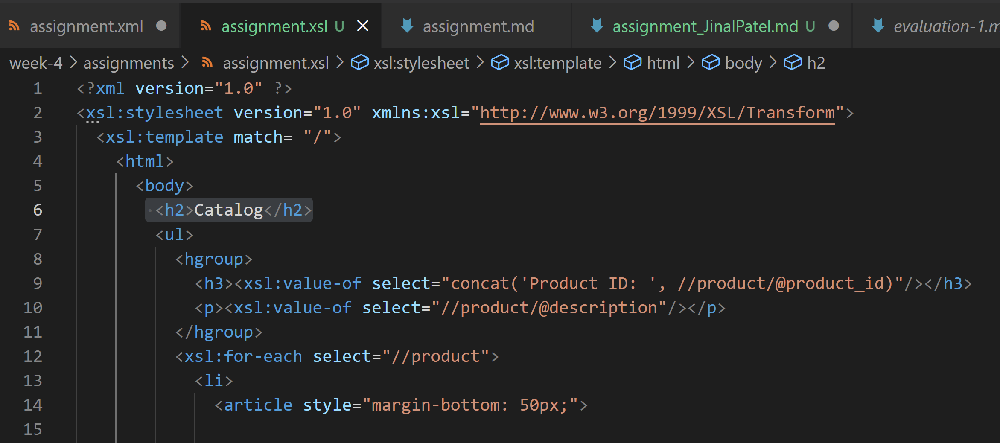

I have created the XSL for assignment.xml. 

I hereby provided the thought process behind the same: 

Step1:  main title is "Catalog"

Here I have given the title using the heading (h2) tag. 

Step2: use html list tag to display catalog

Here, I have used the UL tag to list the catalog and grouped heading using <hgroup> for product id and description.
Where, xsl:value-of select is used basically to extract the value of selected node.
So for product id, It will extract all the products using '//product' from the catalog and then extract the product id using '/@product_id' . Similarily for the description using '//product/@description.'

Step3: render each item as `<article>` inside list item tag

To render every ite, I have used <article> tag and styled it using css 'margin-bottom: 60px'

Step4: display product id as h3

While grouping the heading i Have used <h3> for product_id

Step5: display product description as paragraph

While grouping the heading I have used 
 tag to display description as paragraph.

Step6: render table of cataaalog items with columns: item number, price, gender, small, medium, large, extra large (if column item is not present in item, then display empty cell)

I have used the <table> tag to display data in table format,used <tr> tag to create a row and inside it, used <th> tag to display the table column headings i.e. item number, price, gender, small, medium, large, extra large

Step 7: for gender column render M for Men, W for Women

In <td> i.e. table data for gender, I have used <xsl:when> element which evaluates an expression, in this case it will evaluate @gender = 'Men', if the gender is men, it will render it with "M". <xsl:otherwise> is used if the "when" condition is false, it will come to otherwise and render the women with "W".

Step 8: inside size columns (small, medium, large, and extra large) display subtable with 2 columns: color and image

In table data for size, I have used "<xsl:if test="size/@description = 'Small'">", it will test that if the size description is small, it will display color and image using the table. similarily for other size.

